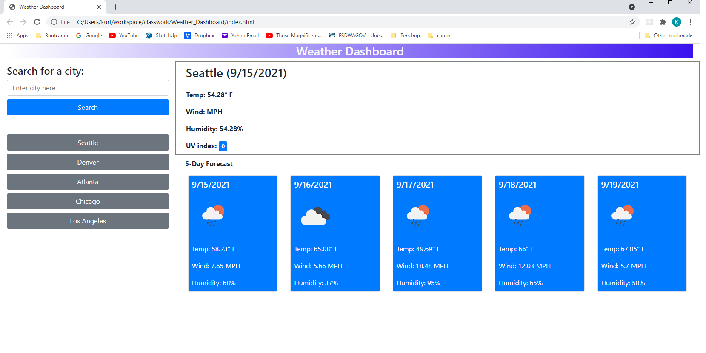

# Weather Dashboard

# This is the submission for Coding Quiz homework [Weather Dashboard](https://uwa.bootcampcontent.com/UWA-Bootcamp/uw-blv-virt-fsf-pt-07-2021-u-c/-/tree/master/06-Server-Side-APIs/02-Homework) for U/W Coding Bootcamp Full Stack Flex Program, for Kurt Heimerman.  

## A few notes about this app:      
* When the app starts it defaults to the city of 'Seattle'.
* The app first makes an API call to openweathermap.org to get the city's latitude & longitude.
* It then makes a subsequent API call to get the current and forecast conditions.
* A user can enter a city name, click 'Search', and be presented with that city's weather info.
* The app saves weather info for cities in local storage.
* The app is responsive.

## The deployed app is here:  https://kurtgithubok.github.io/Weather_Dashboard/

## It uses HTML, CSS, Web-API fetch, and Javascript.

## The most challenging part of this exercise was accounting for structuring methods without resorting to deep nesting of API calls.

